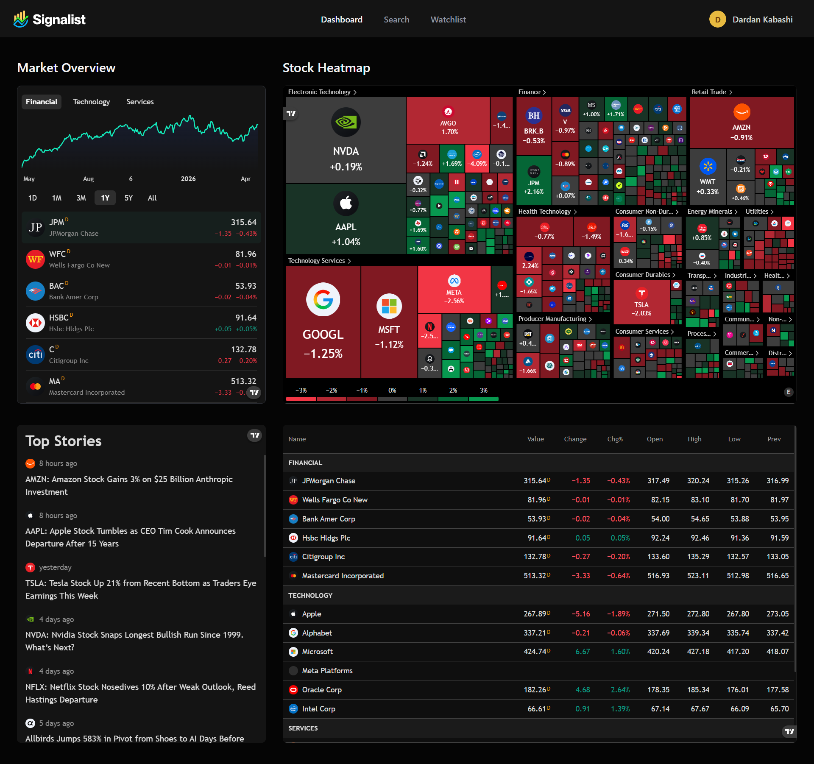
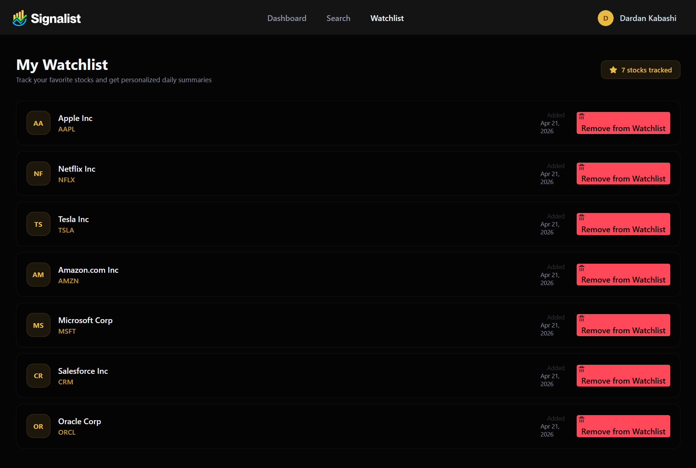

# 📈 MarketPulse - Real-Time Stock Market Intelligence Platform

A modern, full-stack financial platform that turns complex market data into actionable insights. MarketPulse solves a real problem faced by retail investors every day: staying on top of the market without drowning in noise. From live price tracking to AI-generated daily summaries and personalized watchlists, the platform delivers institutional-grade tools in a clean, focused experience.

Built with **Next.js 15, TypeScript, MongoDB, Better Auth, Inngest, and Google Gemini**, MarketPulse combines real-time financial data with event-driven AI workflows to give investors a genuine edge without the complexity of traditional trading terminals.

**🔗 Live Demo:** [marketpulse-site.vercel.app](https://marketpulse-site.vercel.app)

**🔑 Try It Out:** Create a free account in under 30 seconds. Sign-up unlocks the full dashboard, watchlist functionality, and triggers a personalized AI welcome email generated by Google Gemini based on your stated investment profile.

---

## ✨ Features

✅ **Real-Time Market Dashboard** - Live market overview, sector heatmaps, top financial news, and market data across Indices, Stocks, Crypto, Forex, Bonds, and ETFs, all powered by TradingView widgets.  
✅ **Intelligent Stock Search** - Debounced global search with a command palette interface (Ctrl+K / Cmd+K), returning live results from the Finnhub API with symbol, company name, and exchange metadata.  
✅ **In-Depth Stock Detail Pages** - Candlestick charts, baseline comparisons, technical analysis gauges (Strong Buy/Sell indicators), company profiles, and full financial statements for every ticker.  
✅ **Personalized Watchlist with Persistence** - Add or remove stocks with one click, persisted per user in MongoDB, with instant UI updates powered by Next.js path revalidation.  
✅ **AI-Powered Welcome Emails** - On sign-up, an Inngest background function invokes Google Gemini to generate a fully personalized welcome message based on the user's country, investment goals, risk tolerance, and preferred industry.  
✅ **Scheduled Daily News Summaries** - A cron-triggered Inngest workflow runs every day at 12:00 UTC, pulling watchlist-specific news per user, summarizing it with Gemini, and delivering a clean HTML digest via Nodemailer.  
✅ **Secure Authentication** - Email and password authentication with hashed credentials, session management, and middleware-protected routes, powered by Better Auth.  
✅ **Event-Driven Architecture** - User signups, email delivery, and news summarization run as decoupled background jobs, with automatic retries and full observability through the Inngest dashboard.  
✅ **Fully Responsive Dark UI** - Optimized for desktop, tablet, and mobile with a finance-first dark mode designed for long reading sessions.  
✅ **Type-Safe End-to-End** - Full TypeScript coverage from MongoDB models through server actions to React components.

---

## 🔥 Tech Stack

### 🖥️ Frontend
- **Next.js 15** (App Router, Server Actions, Server Components, Route Groups)
- **TypeScript** for complete type safety
- **Tailwind CSS** for utility-first styling
- **ShadCN UI** for accessible, composable components
- **React Hook Form** for performant form validation
- **TradingView Widgets** for professional-grade financial visualizations
- **Lucide React** for consistent iconography

### 🔧 Backend & Services
- **MongoDB Atlas** with **Mongoose ODM** for flexible, scalable data storage
- **Better Auth** for email/password authentication, session handling, and route protection
- **Inngest** for event-driven background jobs, cron workflows, and durable AI orchestration
- **Google Gemini 2.5 Flash Lite** for personalized email generation and news summarization
- **Finnhub API** for real-time stock search, company profiles, and market news
- **Nodemailer** for transactional email delivery via Gmail SMTP

### 🚀 Deployment
- **Vercel** (Production hosting with automatic CI/CD on push)
- **GitHub** (Version control and source of truth for deployments)

---

## 🎯 The Problem It Solves

Retail investors today have more data available than ever, but making sense of it is harder than it has ever been. Prices scroll past in real time, news is scattered across dozens of sources, and most platforms either charge premium fees or overwhelm users with complexity.

MarketPulse cuts through that noise. Users track only the stocks they care about, receive concise AI-generated summaries based on their personal investment profile, and access professional-grade charts and financials without a Bloomberg subscription. Everything important lands in their inbox once a day, automatically, without them having to remember to check.

---

## 🏗️ Architecture Highlights

### 🔐 Security
- Better Auth handles password hashing, session cookies, and secure token rotation
- Middleware-level route protection redirects unauthenticated users before server components execute
- Environment-based credential management with separate production and development scopes
- MongoDB network access locked down to explicit IP allowlists

### ⚡ Performance Optimized
- Server Components eliminate client-side data fetching overhead on the dashboard and detail pages
- Debounced search with 300ms delay prevents unnecessary API calls during typing
- React cache wrapper on Finnhub calls deduplicates identical requests within the same render
- Next.js path revalidation gives instant UI updates after watchlist mutations without full reloads
- MongoDB connection pooling via a global cache prevents reconnection storms in serverless environments

### 🧩 Event-Driven Workflow Design
- User signups emit an `app/user.created` event, decoupling registration from email delivery
- Welcome email workflow uses `step.ai.infer` for durable Gemini calls with automatic retries on transient failures
- Daily news summary workflow combines cron scheduling with per-user fan-out, iterating through every registered user independently
- Each workflow step persists state, so a failure midway through summarization does not reprocess already-completed steps

### 📊 Reusable Component Architecture
- Generic `TradingViewWidget` component accepts any script URL and config object, reused across seven distinct chart types
- Custom `useTradingViewWidget` hook centralizes widget lifecycle management (mount, cleanup, re-render)
- Form primitives (`InputField`, `SelectField`, `CountrySelectField`, `FooterLink`) reduce sign-up form boilerplate from hundreds of lines to under 15 lines per field

---

## 📸 Screenshots

### **Landing & Authentication**

### **Sign Up with Personalization**

### **Main Dashboard**

### **Stock Search Command Palette**

### **Stock Detail Page with Charts and Financials**

### **Personal Watchlist**

### **AI-Generated Welcome Email**

### **Daily News Summary Email**

---

## 🚀 Why This Stands Out

MarketPulse is a production-grade application that combines real-time data, background AI workflows, and a polished user experience into a single focused product.

**What makes this project impressive:**

🔹 **Solves a real-world problem** that every retail investor deals with: information overload with no easy way to filter for what matters.  
🔹 **Full TypeScript coverage** from MongoDB schemas through server actions to UI components.  
🔹 **Server Actions architecture** demonstrates mastery of the latest Next.js 15 patterns, including the App Router and Route Groups.  
🔹 **Real AI integration** via Google Gemini, not as a gimmick but for generating content users actually receive in their inbox.  
🔹 **Event-driven background jobs** via Inngest prove comfort with durable workflows, retries, scheduling, and observability, the same pattern used by companies like SoundCloud and GitBook.  
🔹 **Third-party API orchestration** across Finnhub, Gemini, MongoDB Atlas, Better Auth, Nodemailer, and Inngest shows the ability to compose multiple services into a coherent whole.  
🔹 **Professional financial UX** with TradingView widgets elevates the product far above typical CRUD portfolio projects.  
🔹 **Production monitoring via Vercel logs and Inngest run history** proves awareness of debugging, reliability, and real-world operational concerns.

This project is not a tutorial clone or a toy demo. It is a real, deployed, working financial platform with users, sessions, background jobs, scheduled emails, and a persistent database. It demonstrates full-stack proficiency, architectural thinking, and the ability to ship polished, reliable features end-to-end.

---

Built by **Dardan Kabashi**
